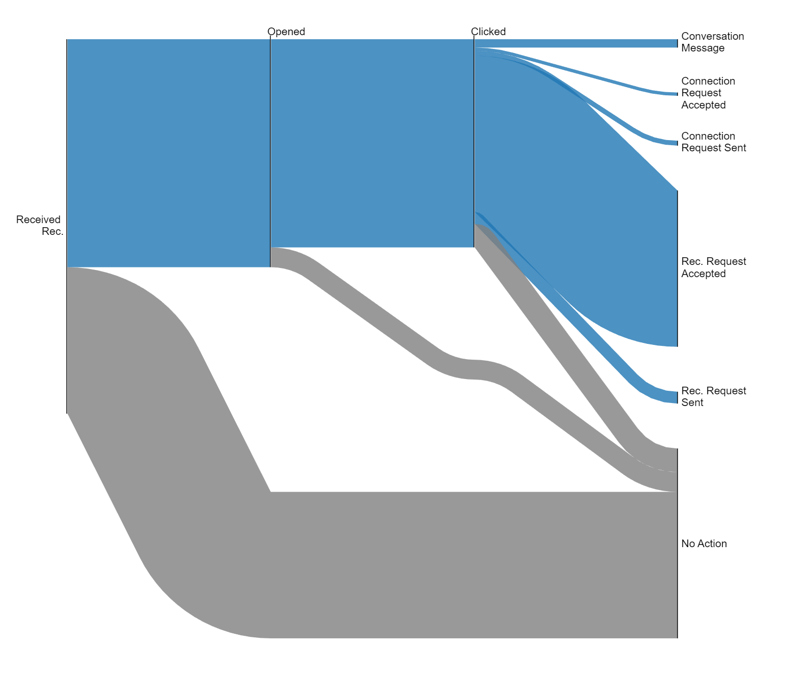
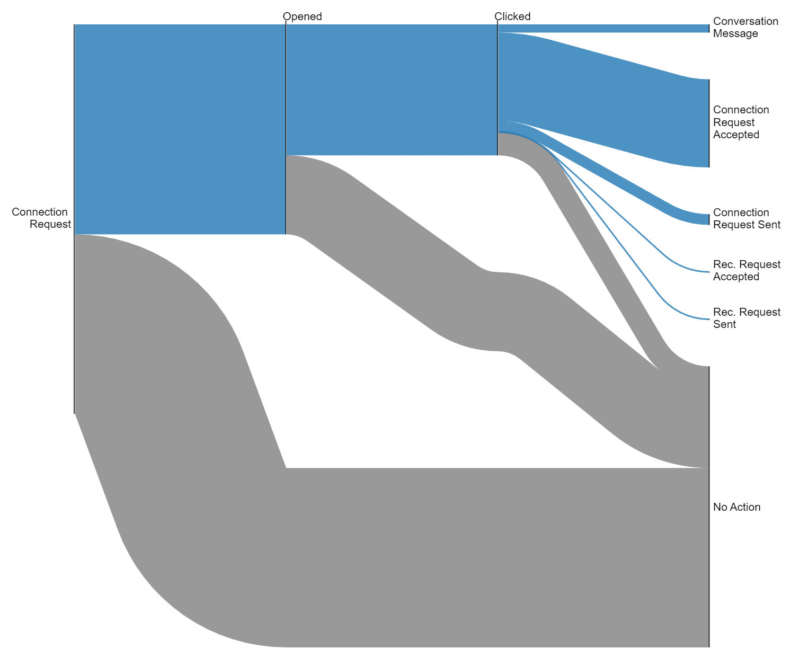

## Notebook Notes

Sample Sankey diagrams showing some of the user journey and drop off rates in engagement. 

### Email 297161
The received request mailer showed much higher open rates and a higher percentage of users: 

### Email 297147
The Connection request mailer has a high open rate, but users are less likely to take action after opening the email:
